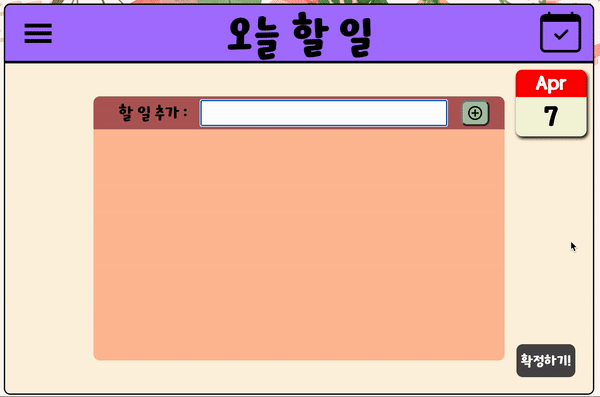
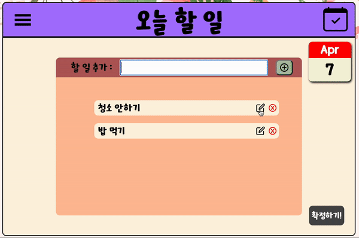
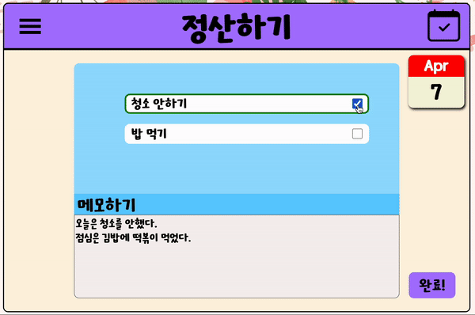

# typescript로 만들어보는 TodoList입니다!

# 기능설명

## 메인 페이지

</img>

 
메인페이지에서는 로그인을 할 수 있습니다. 
계정이 없으면 회원가입 버튼을 눌러 회원가입을 합니다. 이메일, 비밀번호만 입력하면 됩니다. 
로그인, 회원가입은 Firebase Auth 빌드를 기반으로 만들었습니다.  

### test용 계정

    ID : kim@google.com
    password : qwe123

 

</img>

 
로그인 하면 위와 같은 마이페이지로 이동합니다. 
오픈 api서비스로 현재 날씨 정보를 받아오고 지금까지 작성한 todolist 개수를 알려줍니다. 
로그아웃 버튼을 누르면 로그인 페이지로 돌아갑니다.

---

## TodayList 페이지

</img>

TodayList 페이지에서 오늘 할일을 작성합니다. 
list 추가, 수정, 삭제 기능이 있습니다. 
확정하기 버튼을 누르면 오늘 할 일이 확정되고 로컬 스토리지에 저장됩니다.(추후 데이터베이스로 옮길예정)

 

</img>

 

---

## TodayEnd 페이지

</img>

TodayEnd 페이지에서 오늘 한 일을 체크하고, 메모를 남깁니다. 
완료 버튼을 누르면 데이터가 FireStore 데이터베이스에 저장됩니다. 
로그인을 해야 해당 기능을 사용할 수 있습니다.  
성공적으로 저장되면 로컬 데이터가 삭제되고 페이지가 새로고침됩니다.

 

---

## History 페이지

</img>

History 페이지에서 이전에 남긴 todolist와 메모를 확인할 수 있습니다. 
해당 날짜에 남긴 데이터가 있으면 아이콘이 생성됩니다. 
아이콘을 누르면 데이터를 확인할 수 있습니다.

 

---

## 기타

</img>

Navbar를 통해서 다른페이지로 이동할 수 있습니다. 
Header 오른쪽의 버튼을 누르면 미니 달력을 볼 수 있습니다. 

 
